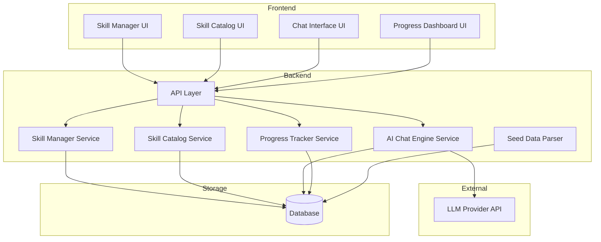
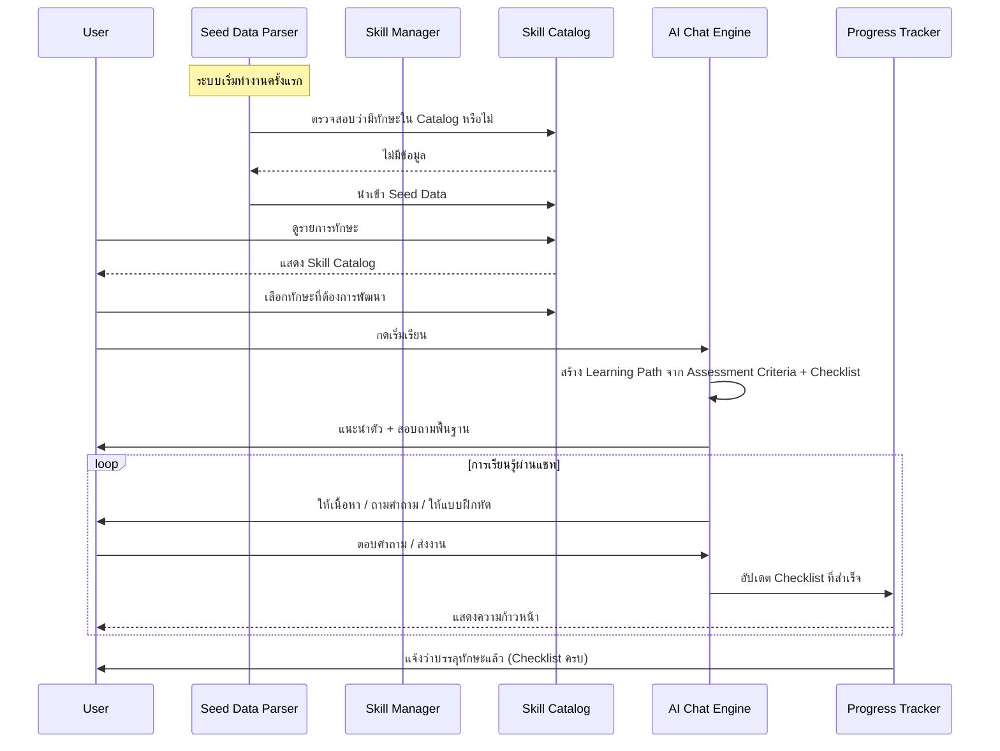
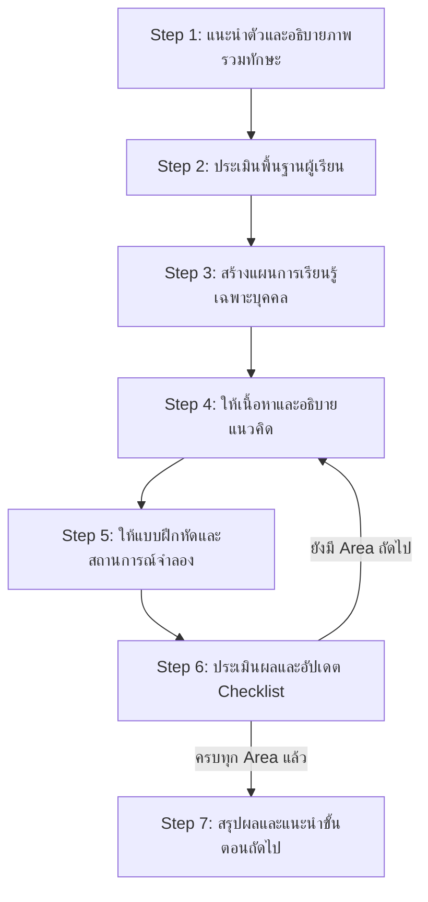
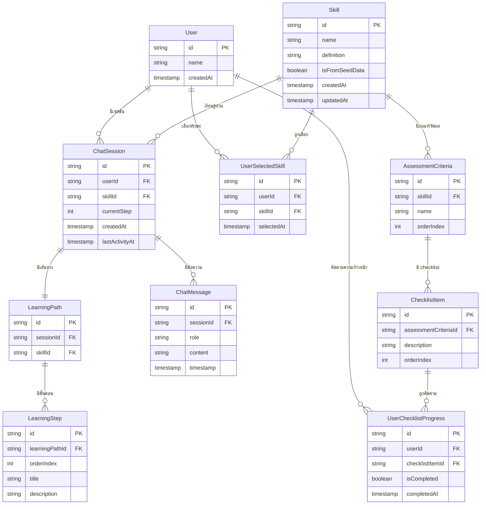

# เอกสารออกแบบ (Design Document)

## ภาพรวม (Overview)

ระบบ Personalized Learning Path เป็น prototype สำหรับการเรียนรู้ทักษะแบบ AI-driven ผ่านการสนทนาแบบ Chat-based โดยมีแนวคิดหลักดังนี้:

- ผู้ใช้ทุกคนมีบทบาทเดียว (single role) สามารถทั้งจัดการข้อมูลทักษะและเรียนรู้ทักษะได้
- AI เป็นผู้ขับเคลื่อนการเรียนรู้ (AI-driven) ผ่านระบบแชท ไม่ใช่ UI แบบ step-by-step
- ใช้ข้อมูลทักษะตั้งต้น (Seed Data) จากไฟล์ `Skills Name.md` ที่มีทักษะ 20+ ทักษะ แต่ละทักษะมีหลาย Areas of Measurement และ Checklist
- ติดตามความก้าวหน้าผ่าน Checklist completion

### เป้าหมายหลัก

1. นำเข้าข้อมูลทักษะจาก Seed Data ได้อัตโนมัติเมื่อเริ่มต้นระบบ
2. ให้ผู้ใช้จัดการทักษะ (CRUD) ได้ครบถ้วน
3. ให้ผู้ใช้เลือกทักษะที่ต้องการพัฒนาและเริ่มเรียนผ่าน AI Chat
4. AI สร้าง Learning Path และนำทางการเรียนรู้เชิงรุก
5. ติดตามความก้าวหน้าตาม Checklist ของแต่ละทักษะ

### การตัดสินใจด้านเทคนิค

เนื่องจากเป็น prototype ที่ยังไม่มี tech stack กำหนด ออกแบบให้เป็น modular architecture ที่ไม่ผูกกับ framework ใดเป็นพิเศษ โดยแบ่งเป็น:
- **Frontend**: UI สำหรับจัดการทักษะ + Chat interface
- **Backend**: API layer + Business logic + AI integration
- **Storage**: Persistent storage สำหรับ Skills, User profiles, Chat sessions, Progress

---

## สถาปัตยกรรม (Architecture)

### แผนภาพสถาปัตยกรรมระดับสูง



### Flow หลักของระบบ




---

## คอมโพเนนต์และอินเทอร์เฟซ (Components and Interfaces)

### 1. Seed Data Parser (SDP)

รับผิดชอบการอ่านและแปลงข้อมูลจากไฟล์ `Skills Name.md` เป็นข้อมูลทักษะในระบบ

**หน้าที่:**
- อ่านไฟล์ Markdown ที่มีตาราง (pipe-delimited table)
- แปลงแต่ละแถวเป็น Skill object โดยจัดการกรณีที่ทักษะหนึ่งมีหลาย Areas of Measurement (แถวที่ Skills Name ว่างเปล่า = เป็น Area เพิ่มเติมของทักษะก่อนหน้า)
- ตรวจสอบความสมบูรณ์ของข้อมูล ข้ามแถวที่ไม่สมบูรณ์และบันทึก log
- ตรวจสอบว่า Skill_Catalog มีข้อมูลอยู่แล้วหรือไม่ก่อนนำเข้า

**Interface:**

```
SeedDataParser:
  parse(fileContent: string): ParseResult
  shouldImport(catalogSize: number): boolean

ParseResult:
  skills: Skill[]
  skippedRows: SkippedRow[]

SkippedRow:
  rowIndex: number
  reason: string
```

**การตัดสินใจออกแบบ:** ไฟล์ Seed Data ใช้รูปแบบตาราง Markdown ที่ทักษะหนึ่งตัวอาจกินหลายแถว (แถวแรกมีชื่อทักษะ แถวถัดไปที่ชื่อว่างเปล่าคือ Area of Measurement เพิ่มเติม) Parser ต้องจัดการ multi-row merging นี้

### 2. Skill Manager Service (SM)

รับผิดชอบ CRUD operations สำหรับทักษะ

**หน้าที่:**
- สร้างทักษะใหม่พร้อม validation
- แก้ไขทักษะที่มีอยู่
- ลบทักษะ (พร้อมยืนยัน)
- Validate ว่าทักษะต้องมี Checklist อย่างน้อย 1 รายการ

**Interface:**

```
SkillManagerService:
  createSkill(input: CreateSkillInput): Result<Skill, ValidationError>
  updateSkill(id: string, input: UpdateSkillInput): Result<Skill, ValidationError>
  deleteSkill(id: string): Result<void, NotFoundError>
  getSkill(id: string): Result<Skill, NotFoundError>

CreateSkillInput:
  name: string (required)
  definition: string (required)
  assessmentCriteria: AssessmentCriteriaInput[] (required, min 1)

AssessmentCriteriaInput:
  name: string (required)
  checklistItems: string[] (required, min 1)

ValidationError:
  fields: { fieldName: string, message: string }[]
```

### 3. Skill Catalog Service (SC)

รับผิดชอบการแสดงรายการทักษะและการเลือกทักษะ

**Interface:**

```
SkillCatalogService:
  listSkills(): Skill[]
  getSkillDetail(id: string): Result<Skill, NotFoundError>
  selectSkillsForLearning(userId: string, skillIds: string[]): Result<void, Error>
  getSelectedSkills(userId: string): Skill[]
```

### 4. AI Chat Engine Service (ACE)

รับผิดชอบการสร้าง Learning Path และนำทางการเรียนรู้ผ่านแชท เป็นหัวใจหลักของระบบ

**หน้าที่:**
- สร้าง Chat Session สำหรับแต่ละทักษะที่ผู้ใช้เลือก
- สร้าง Learning Path จาก Assessment Criteria + Checklist
- ขับเคลื่อนการสนทนาเชิงรุก: ถามคำถาม ให้แบบฝึกหัด แนะนำขั้นตอนถัดไป
- ตอบคำถามของผู้ใช้โดยอ้างอิงบริบทของทักษะ
- อธิบายเนื้อหาเพิ่มเติมเมื่อผู้ใช้ไม่เข้าใจ
- ส่งข้อความกระตุ้นเมื่อผู้ใช้ไม่ตอบกลับนาน
- แจ้ง Progress Tracker เมื่อผู้ใช้ทำ Checklist สำเร็จ

**Interface:**

```
AIChatEngineService:
  startSession(userId: string, skillId: string): ChatSession
  sendMessage(sessionId: string, message: string): ChatResponse
  getSessionHistory(sessionId: string): ChatMessage[]
  getLearningPath(sessionId: string): LearningPath
  summarizeProgress(sessionId: string): ProgressSummary

ChatSession:
  id: string
  userId: string
  skillId: string
  learningPath: LearningPath
  messages: ChatMessage[]
  currentStep: number
  createdAt: timestamp
  lastActivityAt: timestamp

ChatResponse:
  message: ChatMessage
  completedChecklistItems: string[]  // Checklist items ที่ทำสำเร็จจากการสนทนานี้

ChatMessage:
  id: string
  role: "user" | "assistant"
  content: string
  timestamp: timestamp

LearningPath:
  skillId: string
  steps: LearningStep[]

LearningStep:
  order: number
  title: string
  description: string
  relatedChecklistItems: string[]  // อ้างอิง Checklist items ที่เกี่ยวข้อง
  activities: string[]
```

**การตัดสินใจออกแบบ:**
- แต่ละทักษะมี Chat Session แยกกัน เพื่อให้บริบทการสนทนาไม่ปนกัน
- AI สร้าง Learning Path โดยเรียงลำดับจากง่ายไปยาก อ้างอิงจาก Assessment Criteria และ Checklist
- AI ใช้ system prompt ที่มีข้อมูลทักษะ (definition, criteria, checklist) เป็นบริบท

### Learning Path Steps (ขั้นตอนการเรียนรู้ที่ AI พาผู้เรียนเดิน)

AI Chat Engine จะนำทางผู้เรียนผ่าน 7 ขั้นตอนตามลำดับ โดยแต่ละขั้นตอนจะวนซ้ำตาม Assessment Criteria ของทักษะนั้น:



#### Step 1: แนะนำตัวและอธิบายภาพรวมทักษะ (Introduction)
- AI แนะนำตัวเองในฐานะ Learning Companion
- อธิบายชื่อทักษะ + Skill Definition แบบย่อยง่าย
- แสดงจำนวน Areas of Measurement และ Checklist items ทั้งหมด
- บอกผู้เรียนว่าจะเรียนรู้อะไรบ้างในภาพรวม
- **ตัวอย่างข้อความ AI:** "สวัสดีครับ! วันนี้เราจะมาพัฒนาทักษะ Cognitive Flexibility ด้วยกัน ทักษะนี้เกี่ยวกับความสามารถในการคิดอย่างยืดหยุ่น... เราจะเรียนรู้ผ่าน 2 ด้านหลัก และมี checklist 9 ข้อที่จะช่วยวัดความก้าวหน้าของคุณ"

#### Step 2: ประเมินพื้นฐานผู้เรียน (Baseline Assessment)
- AI ถามคำถามปลายเปิด 2-3 ข้อเพื่อประเมินความรู้เดิม
- ถามเกี่ยวกับประสบการณ์ที่เกี่ยวข้องกับทักษะนี้
- ถามว่าผู้เรียนคาดหวังอะไรจากการเรียนรู้ครั้งนี้
- AI วิเคราะห์คำตอบเพื่อปรับระดับเนื้อหาให้เหมาะสม
- **ตัวอย่างคำถาม AI:** "ก่อนเริ่ม อยากถามก่อนนะครับ — เคยเจอสถานการณ์ที่ต้องเปลี่ยนวิธีคิดหรือแผนกลางทางไหมครับ? ตอนนั้นรับมือยังไง?"

#### Step 3: สร้างแผนการเรียนรู้เฉพาะบุคคล (Personalized Plan)
- AI สร้าง Learning Path จาก Assessment Criteria + Checklist ของทักษะ
- ปรับลำดับและความลึกของเนื้อหาตามผลประเมินจาก Step 2
- แสดงแผนการเรียนรู้ให้ผู้เรียนเห็นภาพรวม
- ระบุว่าจะเรียน Area of Measurement ไหนก่อน-หลัง
- **ตัวอย่างข้อความ AI:** "จากที่คุยกัน ผมวางแผนให้เราเริ่มจาก 'การคิดวิเคราะห์และสร้างทางเลือก' ก่อน เพราะเป็นพื้นฐานที่จะช่วยให้ด้านอื่นง่ายขึ้น แผนของเราคือ..."

#### Step 4: ให้เนื้อหาและอธิบายแนวคิด (Content Delivery)
- AI อธิบายแนวคิดหลักของ Area of Measurement ปัจจุบัน
- ใช้ตัวอย่างจริง สถานการณ์ในชีวิตประจำวัน หรือกรณีศึกษา
- อ้างอิง Checklist items ที่เกี่ยวข้องกับ Area นี้
- ถามคำถามเช็คความเข้าใจระหว่างทาง
- ถ้าผู้เรียนไม่เข้าใจ → อธิบายใหม่ด้วยวิธีอื่น (ยกตัวอย่าง, เปรียบเทียบ, แบ่งย่อย)
- **วนซ้ำ:** ทำ Step 4 สำหรับแต่ละ Area of Measurement

#### Step 5: ให้แบบฝึกหัดและสถานการณ์จำลอง (Practice & Exercises)
- AI ให้แบบฝึกหัดที่สอดคล้องกับ Checklist items ของ Area ปัจจุบัน
- รูปแบบแบบฝึกหัด:
  - **สถานการณ์จำลอง (Scenario):** ให้ผู้เรียนตอบว่าจะทำอย่างไรในสถานการณ์ที่กำหนด
  - **คำถามสะท้อนตัวเอง (Reflection):** ให้ผู้เรียนเล่าประสบการณ์จริงที่เกี่ยวข้อง
  - **วิเคราะห์กรณีศึกษา (Case Analysis):** ให้ผู้เรียนวิเคราะห์สถานการณ์ที่ AI ยกมา
  - **วางแผนปฏิบัติ (Action Planning):** ให้ผู้เรียนวางแผนว่าจะนำไปใช้จริงอย่างไร
- AI ให้ feedback ต่อคำตอบของผู้เรียน
- **วนซ้ำ:** ทำ Step 5 สำหรับแต่ละ Area of Measurement

#### Step 6: ประเมินผลและอัปเดต Checklist (Assessment & Progress Update)
- AI ประเมินว่าผู้เรียนผ่าน Checklist items ใดบ้างจากการสนทนาและแบบฝึกหัด
- อัปเดต Progress Tracker สำหรับ Checklist items ที่สำเร็จ
- แสดงสรุปความก้าวหน้า: กี่ข้อผ่านแล้ว / เหลือกี่ข้อ / เปอร์เซ็นต์
- ถ้ายังมี Area of Measurement ถัดไป → กลับไป Step 4 สำหรับ Area ถัดไป
- ถ้าครบทุก Area แล้ว → ไป Step 7
- **ตัวอย่างข้อความ AI:** "จากที่เราคุยกันและทำแบบฝึกหัด คุณผ่าน checklist ไปแล้ว 3 จาก 4 ข้อในด้านนี้ ตอนนี้ progress รวมอยู่ที่ 45% เราไปต่อด้าน 'การปรับเปลี่ยนความคิด แผน และพฤติกรรม' กันเลยนะครับ"

#### Step 7: สรุปผลและแนะนำขั้นตอนถัดไป (Wrap-up & Next Steps)
- AI สรุปสิ่งที่เรียนรู้ทั้งหมดในทักษะนี้
- แสดง Checklist สถานะสุดท้าย (ผ่าน/ไม่ผ่าน ทุกข้อ)
- ถ้า Checklist ครบ 100% → แสดงข้อความยินดีว่าบรรลุทักษะแล้ว
- ถ้ายังไม่ครบ → แนะนำว่าข้อไหนยังต้องพัฒนาเพิ่ม พร้อมคำแนะนำเฉพาะ
- แนะนำทักษะอื่นที่เกี่ยวข้องหรือต่อยอดได้
- **ตัวอย่างข้อความ AI:** "ยินดีด้วยครับ! คุณผ่าน checklist ครบทุกข้อของทักษะ Cognitive Flexibility แล้ว 🎉 สิ่งที่เราเรียนรู้ด้วยกันวันนี้คือ... ถ้าอยากพัฒนาต่อ แนะนำทักษะ Analytical Thinking ที่จะช่วยต่อยอดได้ดีครับ"

### ตารางสรุป Learning Path Steps

| Step | ชื่อ | วัตถุประสงค์ | Input | Output |
|------|------|-------------|-------|--------|
| 1 | Introduction | สร้างความเข้าใจภาพรวม | Skill data (name, definition) | ข้อความแนะนำทักษะ |
| 2 | Baseline Assessment | ประเมินพื้นฐานผู้เรียน | คำตอบจากผู้เรียน | ระดับความรู้เดิม |
| 3 | Personalized Plan | สร้างแผนเฉพาะบุคคล | ผลประเมิน + Assessment Criteria | Learning Path ที่ปรับแล้ว |
| 4 | Content Delivery | ให้เนื้อหาและอธิบาย | Area of Measurement + Checklist | ความเข้าใจแนวคิด |
| 5 | Practice & Exercises | ฝึกปฏิบัติ | Checklist items ของ Area | คำตอบ/ผลงานผู้เรียน |
| 6 | Assessment & Progress | ประเมินและอัปเดต progress | ผลจาก Step 4-5 | Checklist status update |
| 7 | Wrap-up & Next Steps | สรุปและแนะนำต่อ | Progress สุดท้าย | สรุปผล + คำแนะนำ |

### กฎการวนซ้ำ (Loop Rules)

- Step 4 → 5 → 6 วนซ้ำสำหรับแต่ละ Area of Measurement ของทักษะ
- ลำดับ Area ถูกกำหนดใน Step 3 ตามผลประเมินพื้นฐาน
- ผู้เรียนสามารถถามคำถามได้ทุกเมื่อระหว่าง Step 4-6 โดย AI จะตอบแล้วกลับมาที่ flow เดิม
- ถ้าผู้เรียนไม่ตอบกลับนาน AI จะส่งข้อความกระตุ้นให้กลับมาเรียนต่อ

### 5. Progress Tracker Service (PT)

รับผิดชอบการติดตามความก้าวหน้าของผู้ใช้

**Interface:**

```
ProgressTrackerService:
  getProgress(userId: string, skillId: string): SkillProgress
  markChecklistItemComplete(userId: string, skillId: string, checklistItemId: string): SkillProgress
  getAllProgress(userId: string): SkillProgress[]
  isSkillCompleted(userId: string, skillId: string): boolean

SkillProgress:
  userId: string
  skillId: string
  skillName: string
  totalChecklistItems: number
  completedChecklistItems: number
  percentComplete: number  // (completedChecklistItems / totalChecklistItems) * 100
  checklistStatus: ChecklistItemStatus[]
  isCompleted: boolean

ChecklistItemStatus:
  checklistItemId: string
  description: string
  areaOfMeasurement: string
  isCompleted: boolean
  completedAt: timestamp | null
```


---

## แบบจำลองข้อมูล (Data Models)

### แผนภาพ Entity Relationship



### รายละเอียด Data Models

#### Skill
| ฟิลด์ | ชนิด | คำอธิบาย |
|-------|------|----------|
| id | string (UUID) | รหัสทักษะ |
| name | string | ชื่อทักษะ (เช่น "Cognitive Flexibility") |
| definition | string | คำนิยามและรายละเอียดของทักษะ |
| domain | string | หมวดหมู่ของทักษะ (เช่น "Digital, Data & Technology", "Thinking & Problem Solving") |
| assessmentType | string | ประเภทการประเมิน ("Submit Assignment File" หรือ "Chat to Assess") |
| todoListUrl | string | null | ลิงก์ไฟล์ To-Do List หรือ Simulation (ถ้ามี) |
| isFromSeedData | boolean | ระบุว่าเป็นทักษะจาก Seed Data หรือสร้างเพิ่มเติม |
| createdAt | timestamp | วันที่สร้าง |
| updatedAt | timestamp | วันที่แก้ไขล่าสุด |

#### Course (ข้อมูลคอร์สเรียนที่ผูกกับทักษะ)
| ฟิลด์ | ชนิด | คำอธิบาย |
|-------|------|----------|
| id | string (UUID) | รหัสคอร์ส |
| skillId | string (FK) | อ้างอิงทักษะ |
| courseCode | string | รหัสคอร์สจากระบบเดิม (เช่น "TIC21P019") |
| name | string | ชื่อคอร์ส |
| contentProvider | string | ผู้ให้บริการเนื้อหา |
| instructorName | string | ชื่อผู้สอน |
| duration | string | ระยะเวลาคอร์ส (เช่น "1:14:11") |
| orderIndex | int | ลำดับคอร์สภายในทักษะ |

#### AssessmentCriteria
| ฟิลด์ | ชนิด | คำอธิบาย |
|-------|------|----------|
| id | string (UUID) | รหัสเกณฑ์วัดผล |
| skillId | string (FK) | อ้างอิงทักษะ |
| name | string | ชื่อเกณฑ์ (เช่น "การคิดวิเคราะห์และสร้างทางเลือก") |
| orderIndex | int | ลำดับการแสดงผล |

#### ChecklistItem
| ฟิลด์ | ชนิด | คำอธิบาย |
|-------|------|----------|
| id | string (UUID) | รหัส checklist item |
| assessmentCriteriaId | string (FK) | อ้างอิงเกณฑ์วัดผล |
| description | string | ข้อความอธิบายสิ่งที่ผู้เรียนต้องทำ |
| orderIndex | int | ลำดับการแสดงผล |

#### UserChecklistProgress
| ฟิลด์ | ชนิด | คำอธิบาย |
|-------|------|----------|
| id | string (UUID) | รหัส |
| userId | string (FK) | อ้างอิงผู้ใช้ |
| checklistItemId | string (FK) | อ้างอิง checklist item |
| isCompleted | boolean | สถานะสำเร็จ/ยังไม่สำเร็จ |
| completedAt | timestamp | วันที่ทำสำเร็จ (null ถ้ายังไม่สำเร็จ) |

### โครงสร้างข้อมูล Seed Data

ไฟล์ `Skills Name.md` มีรูปแบบตาราง Markdown ดังนี้:

```
| Skills Name | Skill Definition | Areas or Measurement | Checklist (3-5 points) |
| Cognitive Flexibility | คำนิยาม... | 1. การคิดวิเคราะห์... | - checklist item 1 - checklist item 2 ... |
|  |  | 2. การปรับเปลี่ยน... | - checklist item 1 - checklist item 2 ... |
```

**กฎการ parse:**
1. แถวที่มี Skills Name = ทักษะใหม่
2. แถวที่ Skills Name ว่างเปล่า = Area of Measurement เพิ่มเติมของทักษะก่อนหน้า
3. Checklist items คั่นด้วย `\-` (escaped dash) ในแต่ละ cell
4. แถวที่ขาดข้อมูลสำคัญ (ไม่มี Areas of Measurement หรือ Checklist) จะถูกข้าม


---

## คุณสมบัติความถูกต้อง (Correctness Properties)

*Property คือคุณลักษณะหรือพฤติกรรมที่ควรเป็นจริงในทุกการทำงานที่ถูกต้องของระบบ เป็นข้อกำหนดเชิงรูปนัยเกี่ยวกับสิ่งที่ระบบควรทำ Properties ทำหน้าที่เป็นสะพานเชื่อมระหว่าง specification ที่มนุษย์อ่านได้กับการรับประกันความถูกต้องที่เครื่องตรวจสอบได้*

### Property 1: Seed Data Parsing จับคู่คอลัมน์ถูกต้อง

*For any* แถวข้อมูลที่ถูกต้องในตาราง Seed Data ที่มี Skills Name, Skill Definition, Areas of Measurement, และ Checklist ครบถ้วน เมื่อ parse แล้ว Skill object ที่ได้ต้องมี name ตรงกับ Skills Name, definition ตรงกับ Skill Definition, assessment criteria ตรงกับ Areas of Measurement, และ checklist items ตรงกับ Checklist

**Validates: Requirements 1.2**

### Property 2: แถว Seed Data ที่ไม่สมบูรณ์ถูกข้ามพร้อม log

*For any* ชุดข้อมูล Seed Data ที่มีแถวที่ขาดข้อมูลสำคัญ (ไม่มี Areas of Measurement หรือไม่มี Checklist) เมื่อ parse แล้ว จำนวน skills ที่ได้ต้องเท่ากับจำนวนแถวที่สมบูรณ์ และจำนวน skipped rows ต้องเท่ากับจำนวนแถวที่ไม่สมบูรณ์ โดยแต่ละ skipped row ต้องระบุ row index และเหตุผลที่ข้าม

**Validates: Requirements 1.4**

### Property 3: การนำเข้า Seed Data เป็น Idempotent

*For any* Skill_Catalog ที่มีข้อมูลทักษะอยู่แล้ว (catalogSize > 0) เมื่อเรียก shouldImport แล้วต้องได้ false และการเรียก import ซ้ำต้องไม่เปลี่ยนแปลงข้อมูลใน catalog

**Validates: Requirements 1.5**

### Property 4: Skill CRUD Round-Trip

*For any* ข้อมูลทักษะที่ถูกต้อง (มีชื่อ, รายละเอียด, assessment criteria พร้อม checklist items อย่างน้อย 1 รายการ) เมื่อสร้างทักษะแล้วดึงข้อมูลกลับมา ต้องได้ข้อมูลที่ตรงกับที่สร้างไป ทั้งชื่อ รายละเอียด assessment criteria และ checklist items ทุกรายการ

**Validates: Requirements 2.2, 3.2**

### Property 5: การอัปเดตทักษะสะท้อนผลถูกต้อง

*For any* ทักษะที่มีอยู่ในระบบ และข้อมูลอัปเดตที่ถูกต้อง เมื่ออัปเดตแล้วดึงข้อมูลกลับมา ต้องได้ข้อมูลที่ตรงกับข้อมูลอัปเดตใหม่ ไม่ใช่ข้อมูลเดิม

**Validates: Requirements 2.4**

### Property 6: การลบทักษะออกจาก Catalog

*For any* ทักษะที่มีอยู่ใน Skill_Catalog เมื่อลบทักษะนั้นแล้ว การดึงรายการทักษะทั้งหมดต้องไม่พบทักษะที่ถูกลบ และจำนวนทักษะใน catalog ต้องลดลง 1

**Validates: Requirements 2.6**

### Property 7: Validation ปฏิเสธข้อมูลทักษะที่ไม่สมบูรณ์

*For any* ข้อมูลทักษะที่ขาดฟิลด์ที่จำเป็น (ชื่อว่าง, รายละเอียดว่าง, ไม่มี assessment criteria, หรือ checklist items เป็นศูนย์) เมื่อพยายามสร้างหรืออัปเดตทักษะ ระบบต้องปฏิเสธและส่งกลับ ValidationError ที่ระบุฟิลด์ที่มีปัญหา

**Validates: Requirements 2.7, 3.4**

### Property 8: Catalog แสดงทักษะทั้งหมดครบถ้วน

*For any* ชุดทักษะที่ถูกสร้างในระบบ (ทั้งจาก Seed Data และสร้างเพิ่มเติม) Skill_Catalog ต้องแสดงรายการทักษะทั้งหมดโดยไม่ขาดหาย และแต่ละทักษะต้องแสดงชื่อและรายละเอียด

**Validates: Requirements 1.3, 4.1**

### Property 9: รายละเอียดทักษะแสดงข้อมูลครบทุกฟิลด์

*For any* ทักษะในระบบ เมื่อดูรายละเอียดทักษะนั้น ต้องแสดง Assessment_Criteria ทั้งหมดและ Checklist ทุกรายการของทักษะนั้นครบถ้วน

**Validates: Requirements 4.2**

### Property 10: การเลือกทักษะหลายรายการถูกบันทึกครบถ้วน

*For any* ผู้ใช้ และชุดทักษะที่เลือก (1 รายการขึ้นไป) เมื่อเลือกทักษะแล้วดึงรายการทักษะที่เลือกกลับมา ต้องได้ทักษะครบทุกรายการที่เลือกไป

**Validates: Requirements 4.3, 4.4**

### Property 11: Chat Session แยกต่อทักษะ

*For any* ผู้ใช้ที่เลือก N ทักษะ (N ≥ 1) เมื่อเริ่มเรียน ระบบต้องสร้าง Chat Session แยก N เซสชัน โดยแต่ละเซสชันอ้างอิงทักษะคนละตัว

**Validates: Requirements 4.5, 5.4**

### Property 12: Learning Path ครอบคลุม Checklist ทั้งหมด

*For any* ทักษะที่มี checklist items ทั้งหมด M รายการ Learning Path ที่สร้างขึ้นต้องมี relatedChecklistItems รวมกันครอบคลุม checklist items ทั้ง M รายการ โดยไม่มีรายการใดตกหล่น

**Validates: Requirements 5.2**

### Property 13: การคำนวณเปอร์เซ็นต์ความก้าวหน้าถูกต้อง

*For any* ทักษะที่มี checklist items ทั้งหมด T รายการ และผู้ใช้ทำสำเร็จ C รายการ (0 ≤ C ≤ T) เปอร์เซ็นต์ความก้าวหน้าต้องเท่ากับ (C / T) × 100

**Validates: Requirements 7.2, 7.4**

### Property 14: ทักษะสำเร็จเมื่อ Checklist ครบ

*For any* ทักษะที่ผู้ใช้ทำ checklist items ครบทุกรายการ (completedItems = totalItems) สถานะ isCompleted ต้องเป็น true และในทางกลับกัน ถ้ายังไม่ครบ isCompleted ต้องเป็น false

**Validates: Requirements 7.3**

### Property 15: Progress แสดงสถานะ Checklist ครบทุกรายการ

*For any* ผู้ใช้และทักษะที่เลือก เมื่อดึงข้อมูล Progress จำนวน checklistStatus ต้องเท่ากับจำนวน checklist items ทั้งหมดของทักษะนั้น โดยแต่ละรายการต้องมี description, areaOfMeasurement, และ isCompleted

**Validates: Requirements 7.1**


---

## การจัดการข้อผิดพลาด (Error Handling)

### 1. Seed Data Import Errors

| สถานการณ์ | การจัดการ |
|-----------|----------|
| ไฟล์ Seed Data ไม่พบ | บันทึก error log และเริ่มระบบด้วย Skill_Catalog ว่าง |
| ไฟล์ Seed Data มีรูปแบบไม่ถูกต้อง (ไม่ใช่ตาราง Markdown) | บันทึก error log พร้อมรายละเอียด และเริ่มระบบด้วย Skill_Catalog ว่าง |
| แถวข้อมูลไม่สมบูรณ์ (ขาด field สำคัญ) | ข้ามแถวนั้น บันทึก warning log ระบุ row index และ field ที่ขาด ดำเนินการ import แถวอื่นต่อ |
| ข้อมูลซ้ำกับที่มีอยู่แล้ว | ไม่นำเข้าซ้ำ (idempotent) |

### 2. Skill Management Errors

| สถานการณ์ | การจัดการ |
|-----------|----------|
| สร้าง/แก้ไขทักษะโดยขาดฟิลด์ที่จำเป็น | ส่งกลับ ValidationError ระบุฟิลด์ที่ขาด |
| สร้าง/แก้ไขทักษะโดยไม่มี Checklist | ส่งกลับ ValidationError ระบุว่าต้องมี Checklist อย่างน้อย 1 รายการ |
| แก้ไข/ลบทักษะที่ไม่มีอยู่ | ส่งกลับ NotFoundError |
| ลบทักษะที่มีผู้ใช้กำลังเรียนอยู่ | แสดงคำเตือนเพิ่มเติมว่ามีผู้ใช้กำลังเรียนทักษะนี้ |

### 3. Chat Session Errors

| สถานการณ์ | การจัดการ |
|-----------|----------|
| LLM Provider ไม่ตอบสนอง | แสดงข้อความแจ้งผู้ใช้ว่าระบบ AI ไม่พร้อมใช้งานชั่วคราว พร้อม retry mechanism |
| LLM Provider ส่งกลับ error | บันทึก error log และแสดงข้อความแจ้งผู้ใช้ให้ลองใหม่ |
| Chat Session หมดอายุ | อนุญาตให้ผู้ใช้เริ่ม session ใหม่โดยรักษา progress เดิม |

### 4. Progress Tracking Errors

| สถานการณ์ | การจัดการ |
|-----------|----------|
| อัปเดต checklist item ที่ไม่มีอยู่ | ส่งกลับ NotFoundError |
| อัปเดต checklist item ที่สำเร็จแล้วซ้ำ | ไม่เปลี่ยนแปลงสถานะ (idempotent) |

---

## กลยุทธ์การทดสอบ (Testing Strategy)

### แนวทางการทดสอบแบบคู่ (Dual Testing Approach)

ระบบใช้การทดสอบ 2 แบบควบคู่กัน:

1. **Unit Tests**: ทดสอบตัวอย่างเฉพาะ, edge cases, และ error conditions
2. **Property-Based Tests**: ทดสอบคุณสมบัติสากลที่ต้องเป็นจริงกับทุก input

ทั้งสองแบบเสริมกัน — Unit tests จับ bug เฉพาะจุด, Property tests ตรวจสอบความถูกต้องทั่วไป

### Property-Based Testing Configuration

- **Library**: ใช้ property-based testing library ที่เหมาะกับภาษาที่เลือก (เช่น fast-check สำหรับ TypeScript/JavaScript, Hypothesis สำหรับ Python, QuickCheck สำหรับ Haskell)
- **จำนวนรอบ**: ขั้นต่ำ 100 iterations ต่อ property test
- **Tag format**: แต่ละ test ต้องมี comment อ้างอิง property ในรูปแบบ:
  `Feature: personalized-learning-path, Property {number}: {property_text}`
- **กฎสำคัญ**: แต่ละ correctness property ต้องถูก implement ด้วย property-based test เดียว ห้าม implement property-based testing จากศูนย์ ต้องใช้ library เท่านั้น

### ขอบเขตการทดสอบ

#### Property-Based Tests (อ้างอิง Correctness Properties)

| Property | สิ่งที่ทดสอบ | Generator ที่ต้องการ |
|----------|-------------|---------------------|
| Property 1 | Seed Data Parsing | สร้าง random valid Markdown table rows ที่มี 4 คอลัมน์ |
| Property 2 | Incomplete Seed Data Handling | สร้าง random table rows ที่มีบาง field ว่าง |
| Property 3 | Import Idempotency | สร้าง random catalog ที่มีข้อมูลอยู่แล้ว |
| Property 4 | Skill CRUD Round-Trip | สร้าง random valid CreateSkillInput |
| Property 5 | Skill Update | สร้าง random existing skill + random valid UpdateSkillInput |
| Property 6 | Skill Deletion | สร้าง random catalog + เลือก random skill ลบ |
| Property 7 | Validation Rejection | สร้าง random invalid skill inputs (missing fields) |
| Property 8 | Catalog Completeness | สร้าง random set of skills |
| Property 9 | Skill Detail Completeness | สร้าง random skill with criteria and checklist |
| Property 10 | Skill Selection Persistence | สร้าง random user + random subset of skills |
| Property 11 | Separate Chat Sessions | สร้าง random user + random N skills |
| Property 12 | Learning Path Coverage | สร้าง random skill with checklist items |
| Property 13 | Progress Percentage | สร้าง random T (total) และ C (completed) where 0 ≤ C ≤ T |
| Property 14 | Skill Completion | สร้าง random skill + mark all/some checklist items |
| Property 15 | Progress Status Completeness | สร้าง random skill with checklist items + random progress |

#### Unit Tests (ตัวอย่างเฉพาะและ Edge Cases)

| กลุ่ม | ตัวอย่างที่ทดสอบ |
|-------|-----------------|
| Seed Data Import | ระบบเริ่มทำงานครั้งแรกด้วย catalog ว่าง → นำเข้า seed data สำเร็จ (Req 1.1) |
| Seed Data Parsing | Parse ทักษะที่มีหลาย Areas of Measurement (multi-row merging) |
| Seed Data Parsing | Parse ทักษะที่มี Checklist items คั่นด้วย `\-` |
| Skill Validation | สร้างทักษะด้วยชื่อว่าง → ได้ ValidationError |
| Skill Validation | สร้างทักษะด้วย Checklist 0 รายการ → ได้ ValidationError |
| Checklist Management | ลบ checklist item จากทักษะที่มี 2 items → เหลือ 1 item (Req 3.3) |
| Chat Session | เริ่มเรียนทักษะ → สร้าง Chat Session สำเร็จ |
| Progress | ทำ checklist ครบ 100% → isCompleted = true |
| Progress | ทำ checklist 0% → percentComplete = 0, isCompleted = false |
| Inactivity | Session ไม่มี activity เกิน threshold → trigger nudge (Req 6.5) |
